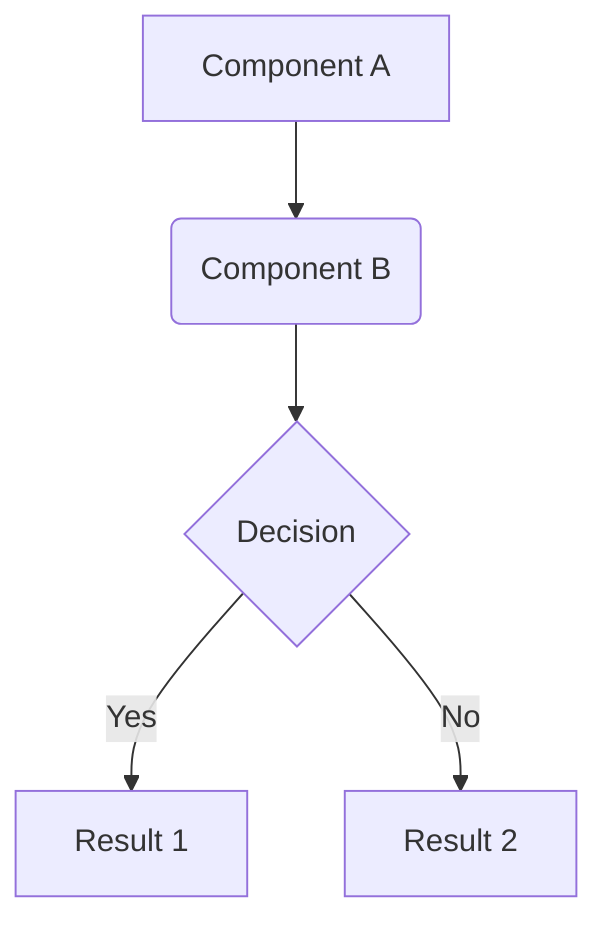

Technical Specification Document: [FEATURE TITLE]
===============================================

---

**TASK-ID:** [BACKLOG TASK ID]
**Status:** Proposed | In Review | Approved
**Author(s):** Architect Agent
**Date:** {{YYYY-MM-DD}}
**Reviewers:** [REVIEWER NAME 1], [REVIEWER NAME 2]

---

Overview and Motivation
-----------------------

Describe in 1-2 paragraphs the problem this feature solves and the business objective. What is the user's pain point or technical need we are addressing?

Solution Architecture
---------------------

Describe the high-level approach. How do components fit together? If applicable, include a diagram (e.g., Mermaid.js) to illustrate data flow or interaction between services.



Detailed Design
---------------

- API Contracts (if applicable)

  Detail new API endpoints or modifications to existing ones. Specify HTTP method, path, parameters, request body, and response format including status codes.

  - Endpoint: `POST /api/v1/resource`
  - Description: Creates a new resource.
  - Request Body (`application/json`):

    ```json
    {
      "name": "string",
      "priority": "integer"
    }
    ```

  - Success Response (`201 Created`):

    ```json
    {
      "id": "uuid",
      "name": "string",
      "priority": "integer",
      "createdAt": "timestamp"
    }
    ```

- Data Model / Schema Changes

  Describe any new database tables, columns, indexes, or changes to existing data structures. Specify data types, constraints, and relationships.

  - New Table: `resources`

    | Column     | Data Type      | Constraints  | Description          |
    | :---       | :---           | :---         | :---                 |
    | `id`       | `UUID`         | PRIMARY KEY  | Unique identifier.   |
    | `name`     | `VARCHAR(255)` | NOT NULL     | Resource name.       |
    | `priority` | `INTEGER`      | NOT NULL     | Priority (0..3).     |

- Integration with Existing Services

  List existing services or modules consumed by this feature and describe how the interaction will occur.

  - Authentication Service: Validate the user's token before allowing resource creation.
  - Notifications Service: After successful creation, send a message to notify administrators.

Non-Functional Requirements (NFRs)
----------------------------------

List quality requirements not directly related to functionality.

- Performance: The create-resource API must respond in under 200ms (p95).
- Security: Sanitize all API inputs to prevent XSS and SQL injection. Access to the endpoint requires the `resource:write` scope.
- Observability: Export metrics (count, latency, errors) for the new endpoint to Prometheus. Emit structured logs at each step of the process.

Testing Strategy
----------------

Describe the overall approach to ensure quality. What types of tests are required?

- Unit Tests: Cover the business logic in the service layer.
- Integration Tests: Validate interaction with the database and notifications service.
- Contract Tests: Ensure the API payload complies with the specification.

Risks and Mitigations
---------------------

Identify potential technical or business risks and describe a mitigation plan.

- Risk: The external notifications API may be unstable.
- Mitigation: Implement retry with exponential backoff and a dead-letter queue for persistently failing messages.

Out of Scope
------------

Explicitly list what will not be included in this implementation to set expectations.

- Editing or deleting resources.
- A user interface to manage resources (API only).
