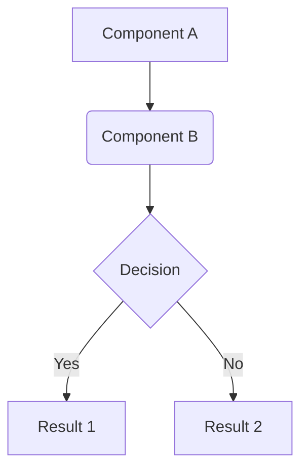

# Technical Specification Document: [FEATURE TITLE]

---

**TASK-ID:** [BACKLOG TASK ID]
**Status:** Proposed | In Review | Approved
**Author(s):** Arquiteto Agent
**Date:** {{YYYY-MM-DD}}
**Reviewers:** [REVIEWER NAME 1], [REVIEWER NAME 2]

---

## 1. Overview and Motivation

*(Describe in 1-2 paragraphs the problem this feature solves and the business objective. What is the user's pain point or technical need we are addressing?)*

## 2. Solution Architecture

*(Describe the high-level approach. How do components fit together? If applicable, include a diagram (e.g., Mermaid.js) to illustrate data flow or interaction between services.)*



## 3. Detailed Design

### 3.1. Contratos de API (se aplicável)

*(Detalhe aqui os novos endpoints de API ou as modificações em endpoints existentes. Especifique o método HTTP, o caminho, os parâmetros, o corpo da requisição e o formato da resposta, incluindo códigos de status.)*

**Endpoint:** `POST /api/v1/novo-recurso`

* **Descrição:** Cria um novo recurso.
* **Corpo da Requisição (`application/json`):**

    ```json
    {
      "nome": "string",
      "prioridade": "integer"
    }
    ```

* **Resposta de Sucesso (`201 Created`):**

    ```json
    {
      "id": "uuid",
      "nome": "string",
      "prioridade": "integer",
      "criadoEm": "timestamp"
    }
    ```

### 3.2. Modelo de Dados / Alterações no Schema

*(Descreva quaisquer novas tabelas de banco de dados, colunas, índices ou alterações em estruturas de dados existentes. Especifique tipos de dados, restrições e relacionamentos.)*

**Nova Tabela: `recursos`**

| Coluna | Tipo de Dado | Restrições | Descrição |
| :--- | :--- | :--- | :--- |
| `id` | `UUID` | PRIMARY KEY | Identificador único. |
| `nome` | `VARCHAR(255)`| NOT NULL | Nome do recurso. |

### 3.3. Integração com Serviços Existentes

*(Liste os serviços ou módulos existentes que serão consumidos por esta nova feature e descreva como a interação ocorrerá.)*

* **Serviço de Autenticação:** Será utilizado para validar o token do usuário antes de permitir a criação do recurso.
* **Serviço de Notificações:** Após a criação bem-sucedida, uma mensagem será enviada para este serviço para notificar os administradores.

## 4. Requisitos Não-Funcionais (NFRs)

*(Liste os requisitos que não estão diretamente relacionados à funcionalidade, mas à qualidade do sistema.)*

* **Performance:** A API de criação de recurso deve responder em menos de 200ms (p95).
* **Segurança:** Todas as entradas da API devem ser sanitizadas para prevenir XSS e injeção de SQL. O acesso ao endpoint requer o escopo `recurso:escrever`.
* **Observabilidade:** Métricas (quantidade, latência, erros) para o novo endpoint devem ser exportadas para o Prometheus. Logs estruturados devem ser emitidos em cada etapa do processo.

## 5. Estratégia de Testes

*(Descreva a abordagem geral para garantir a qualidade. Que tipo de testes são necessários?)*

* **Testes Unitários:** Cobrir toda a lógica de negócio na camada de serviço.
* **Testes de Integração:** Validar a interação com o banco de dados e com o serviço de notificações.
* **Testes de Contrato:** Garantir que o payload da API esteja em conformidade com a especificação.

## 6. Riscos e Mitigações

*(Identifique potenciais riscos técnicos ou de negócio e descreva um plano para mitigá-los.)*

* **Risco:** A API externa de notificações pode ser instável.
* **Mitigação:** Implementar um padrão de `retry com backoff exponencial` e uma `dead-letter queue` para mensagens que falharem persistentemente.

## 7. Fora do Escopo

*(Liste explicitamente o que **não** será incluído nesta implementação para gerenciar as expectativas.)*

* A funcionalidade de **edição** ou **exclusão** de recursos.
* Uma interface de usuário para gerenciar os recursos (apenas a API será criada).
