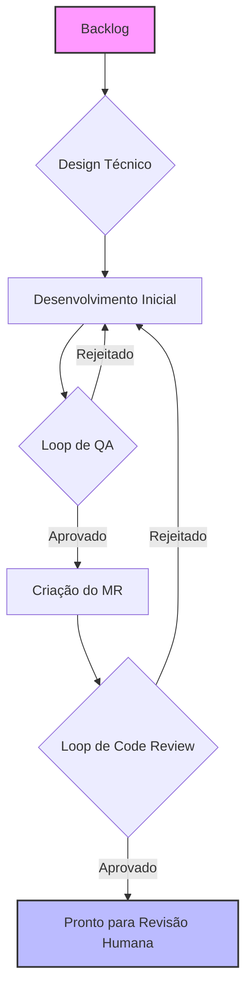
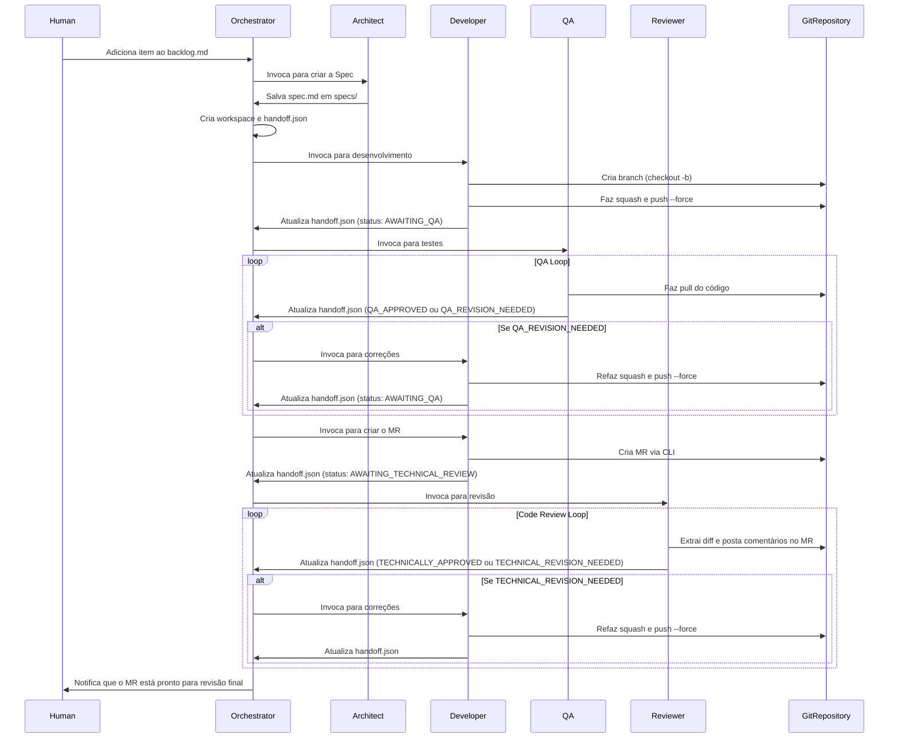

# Sistema Autônomo de Agentes de Desenvolvimento


## 1. Visão Geral

Este projeto implementa um sistema autônomo de múltiplos agentes para desenvolvimento de software. Ele utiliza um time de cinco agentes de IA especializados para transformar um requisito de negócio em um Merge Request (MR) de alta qualidade e revisado, pronto para aprovação humana. O objetivo é padronizar o ciclo de desenvolvimento, assegurar a qualidade de código e de processo, e automatizar tarefas repetitivas.

## 2. Instalação Rápida

Para clonar o repositório e preparar automaticamente a estrutura do diretório `.sde_workspace`, execute o comando abaixo no seu terminal:

```sh
curl -sSL https://raw.githubusercontent.com/brain-model/sde-workspace/main/install.sh | bash -s -- https://github.com/brain-model/sde-workspace.git
```

> **O que este comando faz?** Ele baixa o script `install.sh` do repositório, executa com `bash` e passa a URL do repositório como argumento para o script clonar. Após o clone, ele roda `make install` para criar toda a estrutura necessária.

### 2.1. Opções do instalador (versão e idioma)

Após o clone, o instalador pedirá para escolher:

- Versão: `default` ou `github-copilot` (padrão: `default`)
- Idioma: `en` ou `pt-br` (padrão: `en`)

O que cada opção faz:

- `default`: Cria apenas a estrutura base de `.sde_workspace` via `make install`.
- `github-copilot`: Além da estrutura base, executa `make setup-copilot` para gerar `.github/copilot-instructions.md` e os chat modes em `.github/chatmodes/`.

Notas sobre branches selecionadas automaticamente pelo instalador:

- Para `github-copilot`, o instalador tenta primeiro branches preparadas para o Copilot (ex.: `copilot`, `github-copilot`, `feature/setup-copilot`).
- Para `pt-br`, ele também tenta uma branch em português (ex.: `pt-br`, `copilot-pt-br`). Se nenhuma existir, mantém a branch base (`main` ou `master`).

Exemplo (Copilot em Português):

```bash
# When prompted by the installer
Version: github-copilot
Language: pt-br
```

## 3. Arquitetura do Sistema

### 3.1. Estrutura de Diretórios

```bash
.sde_workspace/
├── backlog/            # Contém o backlog de tarefas a serem desenvolvidas.
├── specs/              # Armazena documentos de Especificação Técnica.
├── workspaces/         # Área de trabalho ativa para cada tarefa em progresso.
├── archive/            # Arquivo de tarefas concluídas.
└── system/
    ├── guides/         # Guias de referência, como o guia de commits semânticos.
    ├── agents/         # Prompts que definem cada agente.
    └── templates/      # Modelos de artefatos (specs, relatórios de QA, etc.).
```

### 3.2. Os Agentes

- **Orquestrador:** O “maestro” do sistema. Gerencia a máquina de estados e invoca os outros agentes.
- **Arquiteto:** Traduz requisitos de negócio em especificações técnicas detalhadas.
- **Desenvolvedor:** Implementa código, gerencia o ciclo de vida Git e cria Merge Requests.
- **QA (Quality Assurance):** Valida a implementação contra a especificação e busca por bugs.
- **Revisor:** Realiza o code review técnico com foco em qualidade, arquitetura e segurança.

## 4. Fluxo de Operação

O workflow é um processo sequencial com ciclos de feedback para garantir qualidade em cada etapa.

### 4.1. High-Level Flow Diagram



### 4.2. Diagrama de Sequência Detalhado



## 5. Uso e Instalação Detalhada

### 5.1. Pré-requisitos

- `git` instalado e configurado.
- `make` instalado.
- CLI do provedor Git instalada e autenticada (ex.: `gh` para GitHub, `glab` para GitLab).
- Ambiente de execução para os agentes (ex.: Python com bibliotecas necessárias).

### 5.2. Instalação Manual

1. **Clone o repositório:**

    ```sh
    git clone https://github.com/brain-model/sde-workspace.git
    ```

2. **Entre no diretório:**

    ```sh
    cd sde-workspace
    ```

3. **Crie a estrutura do workspace:**

    ```sh
    make install
    ```

### 5.3. Fluxo de Uso

1. **Inicie uma Tarefa:** Adicione um novo item detalhado em `.sde_workspace/backlog/BACKLOG.md`, usando `task_template.md` como guia.
2. **Execute o Orquestrador:** Inicie o processo principal (ex.: `python run_orchestrator.py`). O orquestrador detectará a nova tarefa e iniciará o fluxo.
3. **Monitore o Progresso:** Observe mudanças nos diretórios `workspaces/` e o campo `status` nos arquivos `handoff.json`.
4. **Finalize o Processo:** Ao concluir uma tarefa, o Orquestrador moverá para `archive/`. Um MR será aberto no repositório, aguardando revisão final e merge por um humano.

## 6. Configuração do GitHub Copilot (Chat Modes)

Este repositório inclui uma configuração local opcional e leve para aprimorar o GitHub Copilot e o Copilot Chat com diretrizes do projeto e personas de agentes pré-definidas (chat modes). Isso não altera seus arquivos centrais do projeto.

### 6.1. Requisitos

- Extensões do VS Code instaladas e autenticadas com o GitHub:
  - `GitHub.copilot`
  - `GitHub.copilot-chat`
- Opcional: GitHub CLI autenticado (`gh auth login`) para recursos do Copilot CLI.

Comandos rápidos de instalação:

```bash
code --install-extension GitHub.copilot
code --install-extension GitHub.copilot-chat
```

### 6.2. Configuração local (uma vez)

Na raiz do repositório, execute:

```bash
./setup-copilot.sh
```

O que isso faz:

- Gera `.github/copilot-instructions.md` com as regras do projeto (Clean Code, foco em TypeScript, commits semânticos, serviços centrais do Backstage).
- Gera chat modes em `.github/chatmodes/` para as personas:
  - `architect.chatmode.md`
  - `developer.chatmode.md`
  - `qa.chatmode.md`
  - `reviewer.chatmode.md`

Alternativa: você pode escolher a opção `github-copilot` durante a instalação interativa (Seção 2). O instalador executará automaticamente os passos de configuração do Copilot para você.

Depois, recarregue o VS Code:

```bash
# VS Code > Command Palette
Developer: Reload Window
```

### 6.3. Usando os chat modes no Copilot Chat

1. Abra o Copilot Chat no VS Code.
2. Digite `@` para listar os participantes e selecione um dos:
    - Agente Arquiteto
    - Agente Desenvolvedor
    - Agente de QA
    - Agente Revisor
3. Inicie a conversa; cada modo irá guiá-lo com seu papel e processo (escrita de spec, implementação, QA ou code review).

As diretrizes globais do projeto são aplicadas automaticamente a partir de `.github/copilot-instructions.md`.

### 6.4. Opcional: Copilot via GitHub CLI

Instale a extensão do Copilot CLI para `gh`:

```bash
gh extension install github/gh-copilot
```

Exemplos:

```bash
gh copilot explain
gh copilot suggest
```

### 6.5. Solução de Problemas

- Chat modes não aparecem após digitar `@`:
  - Garanta que `.github/chatmodes/*` existe no workspace aberto e recarregue a janela.
- Copilot ignora as regras do projeto:
  - Confirme que `.github/copilot-instructions.md` existe na raiz do repositório.
- Sem acesso ao Copilot:
  - Verifique se sua conta GitHub possui licença ativa do Copilot e está autenticado no VS Code.
