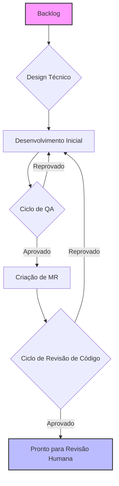
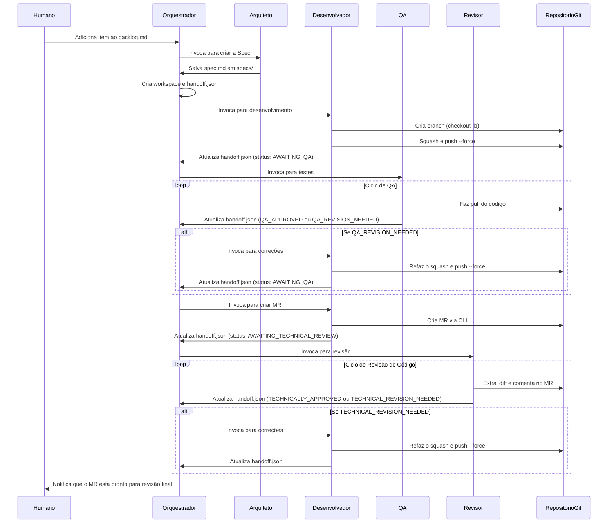

# Sistema Autônomo de Agentes de Desenvolvimento


## 1. Visão Geral

Este projeto implementa um sistema autônomo de múltiplos agentes para desenvolvimento de software. Ele utiliza uma equipe de cinco agentes de IA especializados para transformar um requisito de negócio em um Merge Request (MR) de alta qualidade e revisado, pronto para aprovação humana. O objetivo é padronizar o ciclo de desenvolvimento, garantir qualidade de código e processo, e automatizar tarefas repetitivas.

## 2. Instalação Rápida

Para clonar o repositório e configurar automaticamente a estrutura do diretório `.sde_workspace`, execute o comando abaixo no seu terminal:

```sh
curl -sSL https://raw.githubusercontent.com/brain-model/sde-workspace/main/install.sh | bash -s -- https://github.com/brain-model/sde-workspace.git
```

> O que esse comando faz? Ele baixa o script `install.sh` do repositório, executa com `bash` e passa a URL do repositório como argumento para que o script possa cloná-lo. Após clonar, roda `make install` para criar toda a estrutura necessária.

### 2.1. Opções do instalador (versão e idioma)

Após o clone, o instalador solicitará que você escolha:

- Versão: `default` ou `github-copilot` (padrão: `default`)
- Idioma: `en` ou `pt-br` (padrão: `en`)

O que cada opção faz:

- `default`: Cria apenas a estrutura base de `.sde_workspace` via `make install`.
- `github-copilot`: Além da estrutura base, executa `make setup-copilot` para gerar `.github/copilot-instructions.md` e os chat modes em `.github/chatmodes/`.

Observações sobre as branches selecionadas automaticamente pelo instalador:

- Para `github-copilot`, o instalador tenta primeiro branches preparadas para Copilot (por exemplo, `copilot`, `github-copilot`, `feature/setup-copilot`).
- Para `pt-br`, também tenta uma branch em português (por exemplo, `pt-br`, `copilot-ptbr`). Se não existir, mantém a branch base (`main` ou `master`).

Exemplo (Copilot em Português):

```bash
# Quando o instalador perguntar
Versão: github-copilot
Idioma: pt-br
```

## 3. Arquitetura do Sistema

### 3.1. Estrutura de Diretórios

```bash
.sde_workspace/
├── backlog/            # Contém o backlog de tarefas a serem desenvolvidas
├── specs/              # Armazena Documentos de Especificação Técnica
├── workspaces/         # Área de trabalho ativa para cada tarefa em andamento
├── archive/            # Arquivo de tarefas concluídas
└── system/
    ├── guides/         # Guias de referência, como o guia de commits semânticos
    ├── agents/         # Prompts que definem cada agente
    └── templates/      # Templates de artefatos (specs, relatórios de QA, etc.)
```

### 3.2. Os Agentes

- Orquestrador: O “maestro” do sistema. Gerencia a máquina de estados e invoca os demais agentes.
- Arquiteto: Traduz requisitos de negócio em especificações técnicas detalhadas.
- Desenvolvedor: Implementa o código, gerencia o ciclo de Git e cria Merge Requests.
- QA (Quality Assurance): Valida a implementação contra a especificação e procura bugs.
- Revisor: Realiza revisão técnica de código, com foco em qualidade, arquitetura e segurança.

## 4. Fluxo de Operação

O fluxo de trabalho é sequencial, com ciclos de feedback integrados para garantir qualidade em cada etapa.

### 4.1. Diagrama de Fluxo (Alto Nível)



### 4.2. Diagrama de Sequência (Detalhado)



## 5. Uso e Instalação Detalhada

### 5.1. Pré-requisitos

- `git` instalado e configurado
- `make` instalado
- CLI do provedor Git instalada e autenticada (por exemplo, `gh` para GitHub, `glab` para GitLab)
- Ambiente de execução para os agentes (por exemplo, Python com bibliotecas necessárias)

### 5.2. Instalação Manual

1. Clone o repositório:

    ```sh
    git clone https://github.com/brain-model/sde-workspace.git
    ```

2. Entre no diretório:

    ```sh
    cd sde-workspace
    ```

3. Crie a estrutura do workspace:

    ```sh
    make install
    ```

### 5.3. Fluxo de Uso

1. Inicie uma tarefa: Adicione um item detalhado em `.sde_workspace/backlog/BACKLOG.md`, usando `task_template.md` como guia.
2. Rode o Orquestrador: Inicie o processo principal (por exemplo, `python run_orchestrator.py`). O orquestrador detectará a nova tarefa e iniciará o fluxo.
3. Acompanhe o progresso: Observe mudanças nos diretórios `workspaces/` e o campo `status` nos arquivos `handoff.json`.
4. Finalize o processo: Quando a tarefa for concluída, o Orquestrador moverá para `archive/`. Um MR será aberto no repositório, aguardando revisão final e merge por um humano.

## 6. Configuração do GitHub Copilot (Chat Modes)

Este repositório inclui uma configuração local opcional e leve para aprimorar o GitHub Copilot e o Copilot Chat com diretrizes sensíveis ao projeto e personas predefinidas (chat modes). Isso não altera seus arquivos principais do projeto.

### 6.1. Requisitos

- Extensões do VS Code instaladas e com login no GitHub:
  - `GitHub.copilot`
  - `GitHub.copilot-chat`
- Opcional: CLI do GitHub autenticada (`gh auth login`) para recursos do Copilot via CLI.

Instalação rápida das extensões:

```bash
code --install-extension GitHub.copilot
code --install-extension GitHub.copilot-chat
```

### 6.2. Configuração local única

Na raiz do repositório, execute:

```bash
./setup-copilot.sh
```

O que isso faz:

- Gera `.github/copilot-instructions.md` com regras do projeto (Clean Code, foco em TypeScript, commits semânticos, serviços core do Backstage).
- Gera chat modes em `.github/chatmodes/` para as personas:
  - `architect.chatmode.md`
  - `developer.chatmode.md`
  - `qa.chatmode.md`
  - `reviewer.chatmode.md`

Alternativa: você pode escolher a opção `github-copilot` durante a instalação interativa (Seção 2). O instalador executará automaticamente os passos do setup do Copilot para você.

Depois recarregue o VS Code:

```bash
# VS Code > Command Palette
Developer: Reload Window
```

### 6.3. Como usar chat modes no Copilot Chat

1. Abra o Copilot Chat no VS Code.
2. Digite `@` para listar os participantes e selecione um:
   - Agente Arquiteto
   - Agente Desenvolvedor
   - Agente de QA
   - Agente Revisor
3. Inicie a conversa; cada modo vai guiá-lo com seu papel e processo (redação de spec, implementação, QA ou revisão de código).

As diretrizes globais do projeto são aplicadas automaticamente a partir de `.github/copilot-instructions.md`.

### 6.4. Opcional: Copilot via GitHub CLI

Instale a extensão do Copilot para `gh`:

```bash
gh extension install github/gh-copilot
```

Exemplos:

```bash
gh copilot explain
gh copilot suggest
```

### 6.5. Solução de Problemas

- Chat modes não aparecem após digitar `@`:
  - Verifique se `.github/chatmodes/*` existe no workspace aberto e recarregue a janela.
- Copilot ignora as regras do projeto:
  - Confirme se `.github/copilot-instructions.md` existe na raiz do repositório.
- Sem acesso ao Copilot:
  - Verifique se sua conta GitHub tem licença ativa do Copilot e se você está logado no VS Code.
