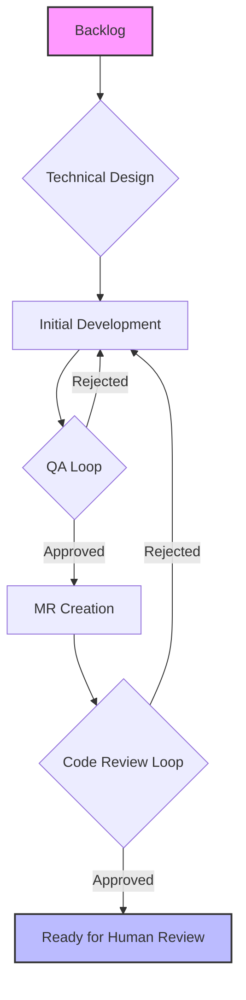
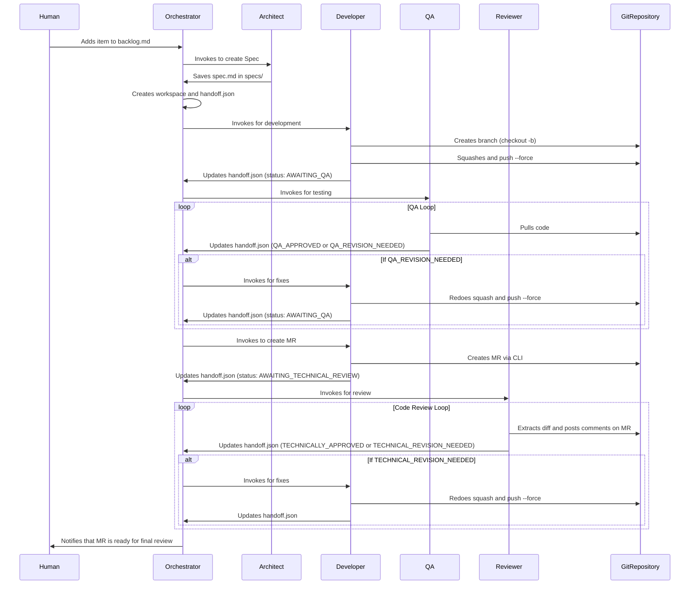

# Autonomous Development Agent System


## 1. Overview

This project implements an autonomous multi-agent system for software development. It uses a team of five specialized AI agents to transform a business requirement into a high-quality, reviewed Merge Request (MR) ready for human approval. The goal is to standardize the development lifecycle, ensure code and process quality, and automate repetitive tasks.

## 2. Quick Installation

To clone the repository and automatically set up the `.sde_workspace` directory structure, run the following command in your terminal:

```sh
curl -sSL https://raw.githubusercontent.com/brain-model/sde-workspace/main/install.sh | bash -s -- https://github.com/brain-model/sde-workspace.git
```

> **What does this command do?** It downloads the `install.sh` script from the repository, executes it with `bash`, and passes the repository URL as an argument so the script can clone it. After cloning, it runs `make install` to create all the necessary directory structure.

### 2.1. Installer options (version and language)

After cloning, the installer will ask you to choose:

- Version: `default` or `github-copilot` (default: `default`)
- Language: `en` or `pt-br` (default: `en`)

What each option does:

- `default`: Creates only the base `.sde_workspace` structure via `make install`.
- `github-copilot`: In addition to the base structure, runs `make setup-copilot` to generate `.github/copilot-instructions.md` and chat modes in `.github/chatmodes/`.

Notes about branches automatically selected by the installer:

- For `github-copilot`, the installer tries Copilot-ready branches first (e.g., `copilot`, `github-copilot`, `feature/setup-copilot`).
- For `pt-br`, it also tries a Portuguese branch (e.g., `pt-br`, `copilot-pt-br`). If none exist, it keeps the base branch (`main` or `master`).

Example (Copilot in Portuguese):

```bash
# When prompted by the installer
Version: github-copilot
Language: pt-br
```

## 3. System Architecture

### 3.1. Directory Structure

```bash
.sde_workspace/
├── backlog/            # Contains the backlog of tasks to be developed.
├── specs/              # Stores Technical Specification Documents.
├── workspaces/         # Active workspace area for each task in progress.
├── archive/            # Archive of completed tasks.
└── system/
    ├── guides/         # Reference guides, such as semantic commit guide.
    ├── agents/         # Contains the prompts that define each agent.
    └── templates/      # Templates for artifacts (specs, QA reports, etc.).
```

### 3.2. The Agents

- **Orchestrator:** The "conductor" of the system. Manages the state machine and invokes other agents.
- **Architect:** Translates business requirements into detailed technical specifications.
- **Developer:** Implements code, manages Git lifecycle, and creates Merge Requests.
- **QA (Quality Assurance):** Validates implementation against specification and looks for bugs.
- **Reviewer:** Performs technical code review, focusing on quality, architecture, and security.

## 4. Operation Flow

The workflow is a sequential process with integrated feedback loops to ensure quality at each stage.

### 4.1. High-Level Flow Diagram



### 4.2. Detailed Sequence Diagram



## 5. Usage and Detailed Installation

### 5.1. Prerequisites

- `git` installed and configured.
- `make` installed.
- Git provider CLI installed and authenticated (e.g., `gh` for GitHub, `glab` for GitLab).
- Runtime environment for agents (e.g., Python with necessary libraries).

### 5.2. Manual Installation

1. **Clone the repository:**

    ```sh
    git clone https://github.com/brain-model/sde-workspace.git
    ```

2. **Enter the directory:**

    ```sh
    cd sde-workspace
    ```

3. **Create the workspace structure:**

    ```sh
    make install
    ```

### 5.3. Usage Flow

1. **Start a Task:** Add a new detailed work item to the `.sde_workspace/backlog/BACKLOG.md` file, using `task_template.md` as a guide.
2. **Run the Orchestrator:** Start the main process (e.g., `python run_orchestrator.py`). The orchestrator will detect the new task and start the flow.
3. **Monitor Progress:** Observe changes in the `workspaces/` directories and the `status` field in `handoff.json` files.
4. **Finalize the Process:** When a task is completed, the Orchestrator will move it to `archive/`. An MR will be open in the repository, awaiting final review and merge by a human.

## 6. GitHub Copilot Setup (Chat Modes)

This repository ships with a lightweight, optional local setup to enhance GitHub Copilot and Copilot Chat with project-aware guidance and predefined agent personas (chat modes). It does not alter your core project files.

### 6.1. Requirements

- VS Code extensions installed and signed in with GitHub:
    - `GitHub.copilot`
    - `GitHub.copilot-chat`
- Optional: GitHub CLI authenticated (`gh auth login`) for Copilot CLI features.

Quick install commands:

```bash
code --install-extension GitHub.copilot
code --install-extension GitHub.copilot-chat
```

### 6.2. One-time local setup

From the repository root, run:

```bash
./setup-copilot.sh
```

What this does:

- Generates `.github/copilot-instructions.md` with project rules (Clean Code, TypeScript focus, semantic commits, Backstage core services).
- Generates chat modes in `.github/chatmodes/` for the personas:
    - `architect.chatmode.md`
    - `developer.chatmode.md`
    - `qa.chatmode.md`
    - `reviewer.chatmode.md`

Alternative: you can choose the `github-copilot` option during the interactive installation (Section 2). The installer will automatically run the Copilot setup steps for you.

Then reload VS Code:

```bash
# VS Code > Command Palette
Developer: Reload Window
```

### 6.3. Using chat modes in Copilot Chat

1. Open Copilot Chat in VS Code.
2. Type `@` to list participants and select one of:
    * Agente Arquiteto
    * Agente Desenvolvedor
    * Agente de QA
    * Agente Revisor
3. Start the conversation; each mode will guide you with its role and process (spec authoring, implementation, QA, or code review).

Global project guidelines are automatically applied from `.github/copilot-instructions.md`.

### 6.4. Optional: Copilot via GitHub CLI

Install the Copilot CLI extension for `gh`:

```bash
gh extension install github/gh-copilot
```

Examples:

```bash
gh copilot explain
gh copilot suggest
```

### 6.5. Troubleshooting

* Chat modes not listed after `@`:
        * Ensure `.github/chatmodes/*` exists in the opened workspace, then reload the window.
* Copilot ignores project rules:
        * Confirm `.github/copilot-instructions.md` exists in the repository root.
* No Copilot access:
        * Verify your GitHub account has an active Copilot license and you are signed in within VS Code.
