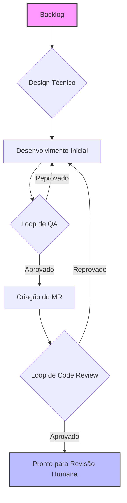
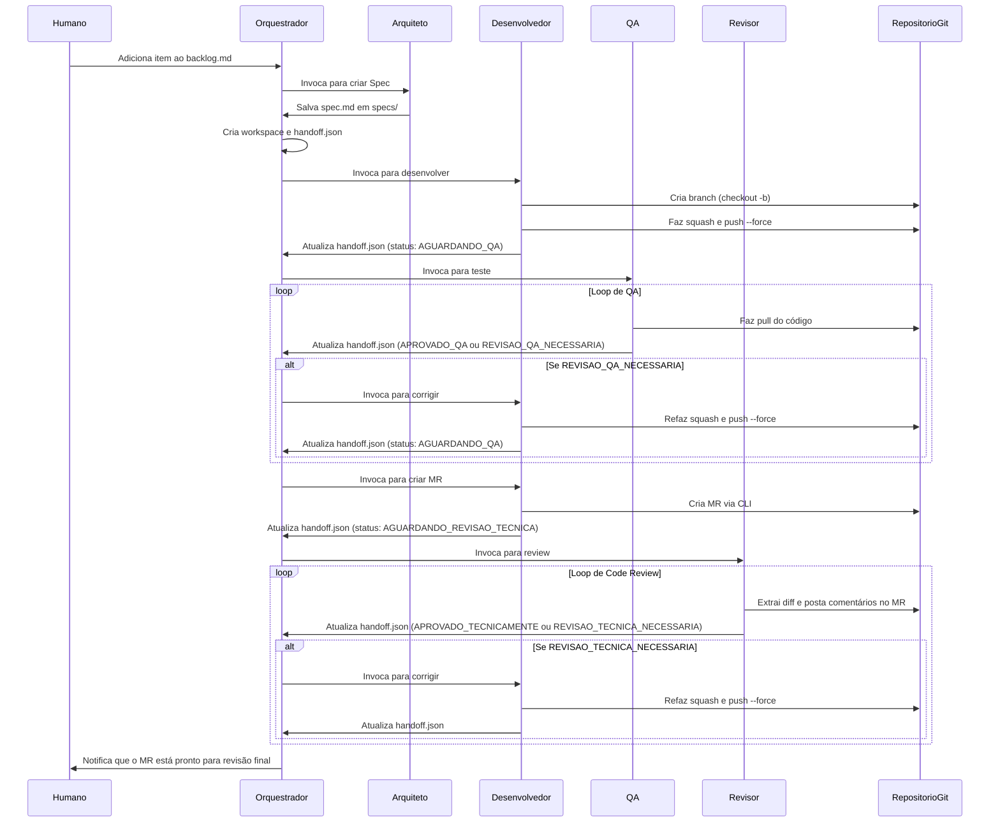

# Sistema de Agentes de Desenvolvimento Autônomo


## 1. Visão Geral

Este projeto implementa um sistema multiagente autônomo para o desenvolvimento de software. Ele utiliza uma equipe de cinco agentes de IA especializados para transformar um requisito de negócio em um Merge Request (MR) de alta qualidade, revisado e pronto para aprovação humana. O objetivo é padronizar o ciclo de vida de desenvolvimento, garantir a qualidade do código e do processo, e automatizar tarefas repetitivas.

## 2. Instalação Rápida

Para clonar o repositório e configurar a estrutura de diretórios do `.sde_workspace` automaticamente, execute o seguinte comando no seu terminal:

```sh
curl -sSL https://raw.githubusercontent.com/brain-model/sde-workspace/main/install.sh | bash -s -- https://github.com/brain-model/sde-workspace.git
```

> **O que este comando faz?** Ele baixa o script `install.sh` do repositório, o executa com `bash`, e passa a URL do repositório como argumento para que o próprio script possa cloná-lo. Após a clonagem, ele executa `make install` para criar toda a estrutura de diretórios necessária.

## 3. Arquitetura do Sistema

### 3.1. Estrutura de Diretórios

```bash
.sde_workspace/
├── backlog/            # Contém o backlog de tarefas a serem desenvolvidas.
├── specs/              # Armazena os Documentos de Especificação Técnica.
├── workspaces/         # Área de trabalho ativa para cada tarefa em andamento.
├── archive/            # Arquivo de tarefas concluídas.
└── system/
    ├── guides/         # Guias de referência, como o de commit semântico.
    ├── agents/         # Contém os prompts que definem cada agente.
    └── templates/      # Templates para artefatos (specs, relatórios de QA, etc.).
```

### 3.2. Os Agentes

* **Orquestrador:** O "maestro" do sistema. Gerencia a máquina de estados e invoca outros agentes.
* **Arquiteto:** Traduz requisitos de negócio em especificações técnicas detalhadas.
* **Desenvolvedor:** Implementa o código, gerencia o ciclo de Git e cria o Merge Request.
* **QA (Quality Assurance):** Valida a implementação contra a especificação e procura por bugs.
* **Revisor:** Realiza o code review técnico, focando em qualidade, arquitetura e segurança.

## 4. Fluxo de Operação

O workflow é um processo sequencial com loops de feedback integrados para garantir a qualidade em cada etapa.

### 4.1. Diagrama de Fluxo de Alto Nível



### 4.2. Diagrama de Sequência Detalhado



## 5. Uso e Instalação Detalhada

### 5.1. Pré-requisitos

* `git` instalado e configurado.
* `make` instalado.
* CLI do provedor Git instalada e autenticada (ex: `gh` para GitHub, `glab` para GitLab).
* Ambiente de execução para os agentes (ex: Python com as bibliotecas necessárias).

### 5.2. Instalação Manual

1. **Clone o repositório:**

    ```sh
    git clone https://github.com/brain-model/sde-workspace.git
    ```

2. **Entre no diretório:**

    ```sh
    cd sde-workspace
    ```

3. **Crie a estrutura do workspace:**

    ```sh
    make install
    ```

### 5.3. Fluxo de Uso

1. **Inicie uma Tarefa:** Adicione um novo item de trabalho detalhado ao arquivo `.sde_workspace/backlog/BACKLOG.md`, utilizando o `task_template.md` como guia.
2. **Execute o Orquestrador:** Inicie o processo principal (ex: `python run_orchestrator.py`). O orquestrador detectará a nova tarefa e iniciará o fluxo.
3. **Monitore o Progresso:** Observe as mudanças nos diretórios `workspaces/` e o campo `status` nos arquivos `handoff.json`.
4. **Finalize o Processo:** Quando uma tarefa for concluída, o Orquestrador a moverá para `archive/`. Um MR estará aberto no repositório, aguardando a revisão final e o merge por um humano.
