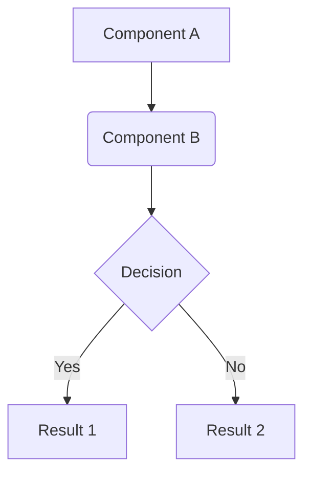

# Technical Specification Document: [FEATURE TITLE]

---

**TASK-ID:** [BACKLOG TASK ID]
**Status:** Proposed | In Review | Approved
**Author(s):** Architect Agent
**Date:** {{YYYY-MM-DD}}
**Reviewers:** [REVIEWER NAME 1], [REVIEWER NAME 2]

---

## 1. Overview and Motivation

*(Describe in 1-2 paragraphs the problem this feature solves and the business objective. What is the user's pain point or technical need we are addressing?)*

## 2. Solution Architecture

*(Describe the high-level approach. How do components fit together? If applicable, include a diagram (e.g., Mermaid.js) to illustrate data flow or interaction between services.)*



## 3. Detailed Design

### 3.1. API Contracts (if applicable)

*(Detail new API endpoints or changes to existing ones. Specify HTTP method, path, parameters, request body, and response format, including status codes.)*

**Endpoint:** `POST /api/v1/resource`

* **Description:** Creates a new resource.
* **Request Body (`application/json`):**

    ```json
    {
      "name": "string",
      "priority": "integer"
    }
    ```

* **Success Response (`201 Created`):**

    ```json
    {
      "id": "uuid",
      "name": "string",
      "priority": "integer",
      "createdAt": "timestamp"
    }
    ```

### 3.2. Data Model / Schema Changes

*(Describe any new database tables, columns, indexes, or changes to existing data structures. Specify data types, constraints, and relationships.)*

**New Table: `resources`**

| Column | Data Type | Constraints | Description |
| :--- | :--- | :--- | :--- |
| `id` | `UUID` | PRIMARY KEY | Unique identifier. |
| `name` | `VARCHAR(255)`| NOT NULL | Resource name. |

### 3.3. Integration with Existing Services

*(List existing services or modules that this feature will consume and describe how the interaction will occur.)*

* **Authentication Service:** Used to validate the user's token before allowing resource creation.
* **Notification Service:** After successful creation, a message will be sent to notify administrators.

## 4. Non-Functional Requirements (NFRs)

*(List requirements not directly related to functionality but to system quality.)*

* **Performance:** The resource creation API must respond in under 200ms (p95).
* **Security:** All API inputs must be sanitized to prevent XSS and SQL injection. Access to the endpoint requires the `resource:write` scope.
* **Observability:** Metrics (count, latency, errors) for the new endpoint must be exported to Prometheus. Structured logs must be emitted at each step.

## 5. Testing Strategy

*(Describe the general approach to ensure quality. What types of tests are required?)*

* **Unit Tests:** Cover all business logic in the service layer.
* **Integration Tests:** Validate interaction with the database and the notification service.
* **Contract Tests:** Ensure the API payload complies with the specification.

## 6. Risks and Mitigations

*(Identify potential technical or business risks and describe a plan to mitigate them.)*

* **Risk:** The external notification API may be unstable.
* **Mitigation:** Implement an exponential backoff retry pattern and a dead-letter queue for persistently failing messages.

## 7. Out of Scope

*(Explicitly list what will **not** be included in this implementation to manage expectations.)*

* Functionality to **edit** or **delete** resources.
* A user interface to manage resources (only the API will be created).
